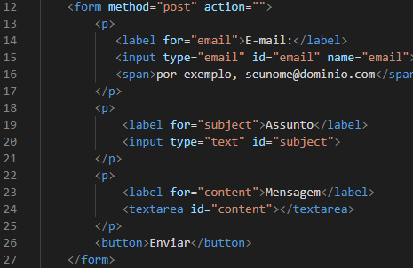

# Elementos de formulário de cadastro📋

## Resultado do projeto

### Código do projeto

## `Form:`
#### `encontrado na linha 12`

* O elemento HTML &lt;"form"&gt; representa uma seção do documento contendo controles interativos para envio de informações.

### method: 
* O método HTTP para enviar o formulário. Os únicos métodos/valores permitidos são (sem distinção entre maiúsculas e minúsculas): 

### post:
* O método POST; dados do formulário enviados como o corpo da solicitação.

### action:
* A URL que processa o envio do formulário. Este valor pode ser substituído por um atributo formaction em um elemento &lt;"button"&gt;,  &lt;"input type="submit"&gt;" ou  &lt;"input type="image"&gt;". Este atributo é ignorado quando  &lt;method="dialog"&gt; é definido.

## `Label:`
#### `encontrado na linha 14`
* O elemento HTML &lt;"label"&gt; representa uma legenda para um item em uma interface de usuário.

### for:
* O valor do foratributo deve ser único idpara um elemento rotulável relacionado ao formulário no mesmo documento que o &lt;"label"&gt; elemento. Portanto, qualquer labelelemento pode ser associado a apenas um controle de formulário.

## `Input:` 
#### `encontrado na linha 15`
* O elemento HTML &lt;"input"&gt; é usado para criar controles interativos para formulários baseados na web para aceitar dados do usuário; uma ampla variedade de tipos de dados de entrada e widgets de controle estão disponíveis, dependendo do dispositivo e do agente do usuário. O elemento &lt;"input"&gt; é um dos mais poderosos e complexos de todo o HTML devido ao grande número de combinações de tipos e atributos de entrada.

### type:
* Uma string especificando o tipo de controle a ser renderizado. Por exemplo, para criar uma caixa de seleção, checkboxé usado um valor de. Se omitido (ou um valor desconhecido for especificado), o tipo de entrada textserá usado, criando um campo de entrada de texto simples.

### id:
* Atributo global válido para todos os elementos, incluindo todos os tipos de entrada, define um identificador único (ID) que deve ser único em todo o documento. Sua finalidade é identificar o elemento durante a vinculação. O valor é usado como o valor do atributo &lt;"label"&gt; forpara vincular o rótulo ao controle de formulário.

### name:
* Uma string especificando um nome para o controle de entrada. Este nome é enviado junto com o valor do controle quando os dados do formulário são enviados. Considere o atributo name obrigatório (mesmo que não seja). Se uma entrada não for especificada, o nome ou o nome estiver vazio, o valor da entrada não será enviado com o formulário.

### type email:
* Um campo para editar um endereço de e-mail. O valor do campo é validado para estar vazio ou ter um único endereço de e-mail válido antes de ser enviado. As pseudoclasses CSS :valid e :invalid são aplicadas apropriadamente.

## `Span:`
#### `encontrado na linha 16`
* O elemento HTML &lt;"span"&gt; é um contêiner embutido genérico para frasear conteúdo, que não representa nada inerentemente. 
Ele pode ser usado para agrupar elementos para fins de estilo (usando os atributos class ou id) ou porque eles compartilham valores de atributos, como lang.

## `Textarea:`
#### `encontrado na linha 24`
* O elemento HTML &lt;"textarea"&gt; representa um controle de edição de texto simples de múltiplas linhas, útil quando você deseja permitir que os usuários insiram uma quantidade considerável de texto em formato livre, por exemplo, um comentário em um formulário de revisão ou feedback.

### id: 
* Um atributo id para permitir que &lt;"textarea"&gt; seja associado a um elemento &lt;"label"&gt; para fins de acessibilidade

## `Button:`
#### `encontrado na linha 26`
* O elemento HTML &lt;"button"&gt; é um elemento interativo ativado por um usuário com mouse, teclado, dedo, comando de voz ou outra tecnologia assistiva. Uma vez ativado, ele executa uma ação, como enviar um formulário ou abrir uma caixa de diálogo.